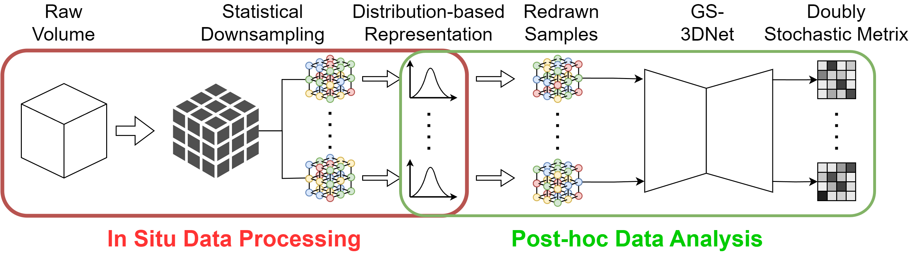
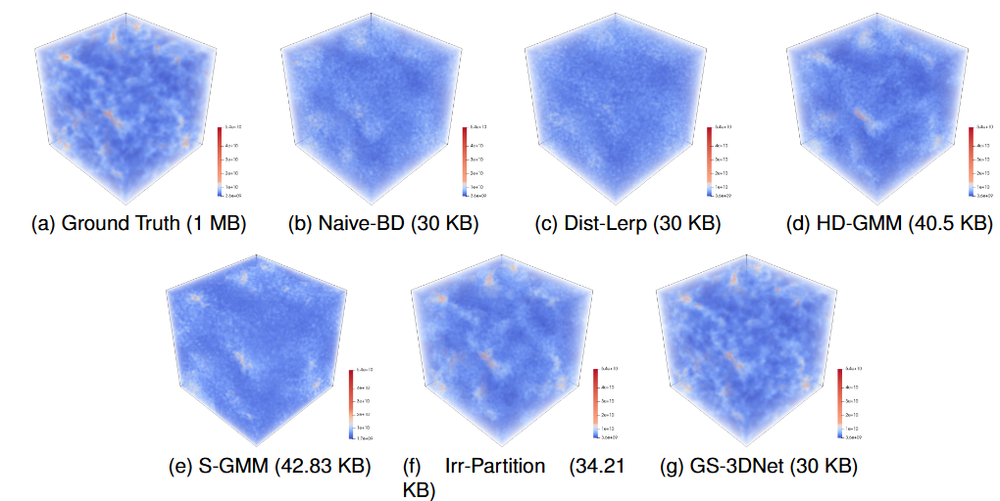

# GS-3DNet
GS-3DNet is a deep learning model based on the Sinkhorm operator and Gumbel trick that learns to map samples drawn from a distribution to spatial locations within the block. The deep learning model can support high-quality downstream data analysis and visualization, provide point-wise
uncertainty quantification, and guarantee the distribution of the reconstructed data block follows the block’s distribution representation.



## Model
During the training phase, the raw data is used to train the latent representation of the sorting. GS-3DNet can effectively learn the spatial relationships in the data through the encoder-decoder architecture. In the prediction phase, the model uses the processed GMM data as input to reorder the redrawn samples and reconstrcut the data.




## Layout
- `GMMDATA` contains the dataset of model, which seperated as train and test sets. Each of them are named with simulation configurations. The file start with `x` is the raw data, `y` is the processed distribution representations consist of block position, parameter, and GMMs.

- `log` stores the training information such as the line chart of training loss, checkpoints, and histogram.

- `result` is the directory storing output reconstructions and ground truth data. The reconstruction of naive BD are made for comparing as well.

- `utils` contains the utils function of model.

## Usage
Training the model
```
python3 main.py
```

Predicting data
```
python3 reconstruct.py
```

Evaluating the reconstruction (excluding EMD)
```
python3 evaluating.py
```


## LICENSE
(c) 2025 Han Huang. MIT License